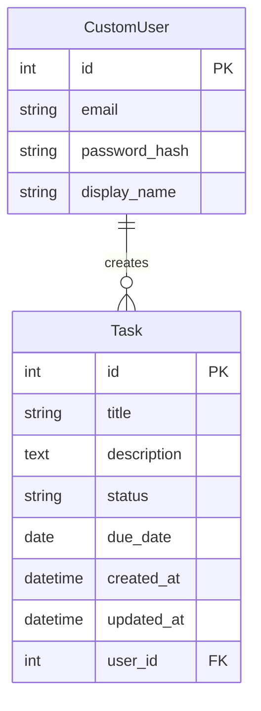

```mermaid
erDiagram

    CustomUser ||--o{ Task : creates

    CustomUser {
        int id PK
        string email
        string password_hash
        string display_name
    }

    Task {
        int id PK
        string title
        text description
        string status
        date due_date
        datetime created_at
        datetime updated_at
        int user_id FK
    }
```
