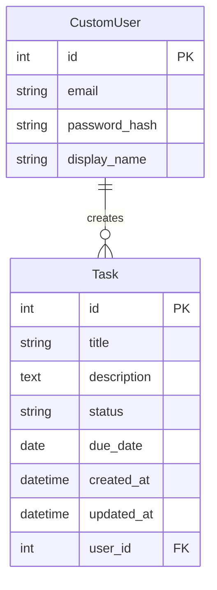

# Django Task Management

📌 Overview（アプリ概要）

🖼️ Screenshots（画面）

🛠️ Tech Stack（使用技術）

🏗️ System Architecture（システム構成図）

🗄️ ER Diagram（ER図）

✨ Features（機能一覧）

🚀 Getting Started（セットアップ）

🧪 Testing（テスト）

📂 Directory Structure（ディレクトリ構成）

🔮 Future Improvements（今後の改善予定）

