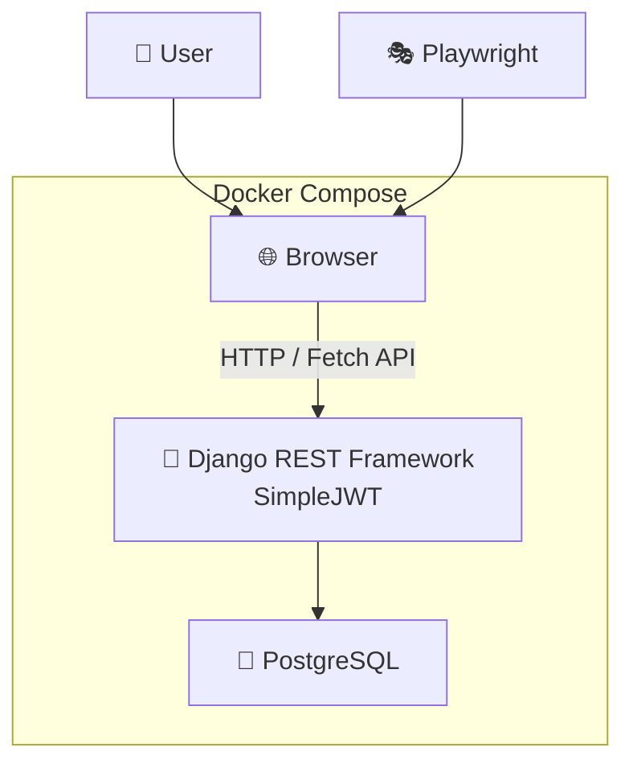
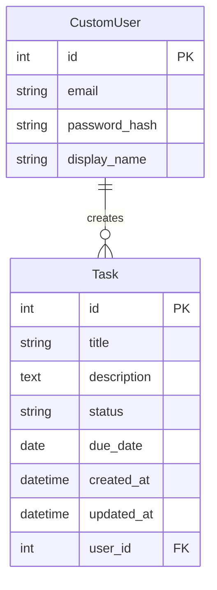

# Django Task Management

Python • Django • Django REST Framework • PostgreSQL • Docker • Playwright • pytest

📌 Overview

Django REST Frameworkを用いてREST APIを構築し、JWT認証を実装したタスク管理アプリです。

Docker Compose・PostgreSQLを用いた開発環境を構築しています。

また、pytestによるAPIテストとPlaywrightによるE2Eテストを実装し、主な機能の動作を確認しています。

🛠️ Tech Stack
| 分類 | 技術 |
|------|------|
| 言語 | Python, JavaScript, HTML, CSS |
| バックエンド | Django, Django REST Framework |
| 認証 | JWT (SimpleJWT) |
| データベース | PostgreSQL |
| テスト | pytest (API Test), Playwright (E2E Test) |
| 開発環境 | Docker, Docker Compose |
| パッケージ管理 | pip, npm |

✨ Features
- ユーザー登録
- ログイン/ログアウト
- タスクの作成・一覧表示・編集・削除（CRUD）
- キーワード検索
- 期限検索
- ステータス管理（未着手・進行中・完了）
- 期限日の設定
- ユーザーごとのタスク管理

🖼️ Screenshots


🏗️ System Architecture
````markdown


🗄️ ER Diagram


🧪 Testing
### APIテスト

- pytestによるAPIテストを実装
- サインアップ、サインイン、タスクCRUD、キーワード検索・期限検索、バリデーション、権限を検証
- 34件のテストケースを実装

### E2Eテスト

- PlaywrightによるE2Eテストを実装
- サインアップ、サインイン、タスクCRUD、キーワード検索・期限検索を検証
- 28件のテストシナリオをChromium・Firefox・WebKitの3ブラウザで実行
### 実行環境

- Dockerコンテナ上でpytestおよびPlaywrightを実行可能

　　### 実行コマンド

　　```bash
　　docker compose exec web pytest
　　```
　　
　　```bash
　　docker compose run --rm playwright

🚀 Getting Started
### 前提条件

- Docker
- Docker Compose

### 1. リポジトリをクローン

```bash
git clone https://github.com/Yokouchi111113/djangotask.git
cd djangotask
```

### 2. 環境変数を設定

`.env.example` をコピーして `.env` を作成します。

**Windows (PowerShell)**

```powershell
copy .env.example .env
```

**Linux / macOS**

```bash
cp .env.example .env
```

必要に応じて `.env` 内の `SECRET_KEY` や `POSTGRES_PASSWORD` を変更してください。

### 3. コンテナを起動

```bash
docker compose up --build
```

### 4. データベースをマイグレーション

```bash
docker compose exec web python manage.py migrate
```

### 5. アプリへアクセス

ブラウザで以下にアクセスしてください。

```
http://localhost:8000
```

📂 Directory Structure
```
djangotask/
├── config/                 # Django project
│   ├── accounts/           # User authentication
│   ├── task/               # Task management app
│   │     └─tests/          # pytest
│   ├── templates/          # HTML templates
│   ├── e2e/                # Playwright tests
│   ├── config/             # Django settings
│   ├── manage.py
│   ├── package.json
│   └── playwright.config.js
├── Dockerfile
├── docker-compose.yml
├── requirements.txt
├── .env.example
└── README.md
```

💡 Highlights
- Django REST Frameworkを用いてREST APIを設計
- JWT認証（SimpleJWT）による認証機能を実装
- Docker Composeで開発・テスト環境を構築
- pytestによるAPIテストを作成
- PlaywrightによるE2Eテストを実装し、Chromium・Firefox・WebKitの3ブラウザで動作を確認
- Playwrightの共通処理（サインアップ・サインイン・タスク作成など）を関数化し、保守性を向上

🔮 Future Improvements
- GitHub Actionsを用いたCIの構築（pytest・Playwrightの自動実行）
- 本番環境へのデプロイ
- UI/UXの改善
